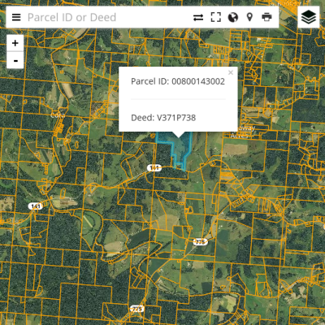

##[OVRDC](http://www.ovrdc.org) Open Parcel Viewer

This open data parcel viewer is a client-side app that uses Leaflet to render a whole county parcel map without the need for a GIS server. Try out the [demo](https://ovrdc.github.io/parcel-viewer/).

##Features
 - Search by any field or multiple fields, such as Name and/or Parcel ID
 - Sidebar, fullscreen, location, printing (using browser print dialog)
 - Render up to (approx) 50k parcels
 - Customized layer control with thumbnails
 - Similar performance on mobile and desktop

##Requirements
 - Data in topojson format, stored in the data folder - see [mapshaper](http://mapshaper.org)
 - A string field in the data titled 'index' to house the searchable attributes (with a separator - see the example)
 - Jekyll (or download the zip file and build the app manually)
 - A free Mapbox API key for using the Mapbox imagery (not necessary, the esri imagery could be used instead)
 - A (free) web server such as GitHub, surge.sh, others...

##Upgrades - Contributions Welcome
 - Create an npm package for the js dependencies
 - Convert from L.TileLayer.Canvas to L.GridLayer to be compatible with Leaflet 1.0
 - Make a Jekyll option for using vector tiles styled in Mapbox
 - Create a function to automatically split the index field and push all the index 'fields' to the popup or the sidebar
 - Add an option to add/remove more/other tools to/from the toolbar
 - Convert the toolbar from using leaflet-top leaflet-left to a new customized leaflet control
 - Documentation on the various options in geojson-vt and the drawing on canvas function
 - Add real support for multiple field search - possibly using fuse or typehead (like Leaflet Bootstrap)

##Issues
 - ~~Past zoom level 18 the parcels disappear - this is an upstream issue with geojson-vt~~ Fixed 04/2016 - The default maxZoom for L.tileLayer.canvas (and L.tileLayer) is 18. In the L.CanvasTiles.js this has been changed to 22.
 - Pinch and zoom on touch devices causes strange behavior so it is disabled, use the zoom buttons (behind the sidebar) instead
 - Zoom animations have been limited to 2 zoom levels for better performance

##Thanks
This app relies on a variety of plugins, but most importantly on the work of [mourner](https://github.com/mourner), [Sumbera](https://github.com/Sumbera), [Stephano Cudini](https://github.com/stefanocudini/) and [Matthew Bloch](https://github.com/mbloch).

This app is powered by Jekyll.
